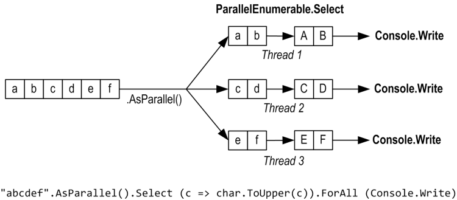
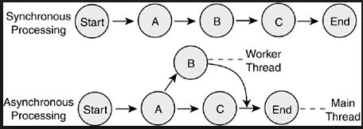

## 平行處理 (Parallel Computing)

* [資料平行處理原則 (工作平行程式庫)](https://docs.microsoft.com/zh-tw/dotnet/standard/parallel-programming/data-parallelism-task-parallel-library)

* [.NET 的平行程式設計](https://docs.microsoft.com/zh-tw/dotnet/standard/parallel-programming/)

* [如何：撰寫簡單的 Parallel ForEach 迴圈](https://docs.microsoft.com/zh-tw/dotnet/standard/parallel-programming/how-to-write-a-simple-parallel-foreach-loop    )


``` C#
string[] files = Directory.GetFiles("../../TestFiles");

Parallel.ForEach(files, (currentFile) =>
{
    string filename = Path.GetFileName(currentFile);
    Console.WriteLine($"Processing {filename} on thread {Thread.CurrentThread.ManagedThreadId}");
});

```

## 非同步程式設計 *(Asynchronous programming)* 或稱 併行處理 *(Concurrent Computing)*


**什麼是非同步程式設計?**
* 一種並行 Concurrent 處理
  * 當呼叫非同步方法之後，將會立即返回呼叫端
  * 並承諾未來將一定會完成這個方法並且得到結果。


**aysnc await 特性說明**
* 除了 void 的 event 方法以外，例如: window form 的 button_click，使用 async 的 function 強烈要求回傳 Task。
  * [非同步方法的傳回型別 (C#)](https://docs.microsoft.com/zh-tw/dotnet/csharp/programming-guide/concepts/async/async-return-types)
* await 只能用在有加入修飾詞 async 的 function 裡面，而且只能 await 有回傳是 Task 型別的方法
* 使用 await 運算式回傳的是 TResult 的型別，而不是回傳 Task<TResult>
``` C#
public async Task<int> GetSumAsync(int a, int b)
{
    int result = await Task.Run(() =>
    {
        return a + b;
    });

    return result;
}
```

### 參考
* [使用 async 和 await 進行非同步程式設計](https://docs.microsoft.com/zh-tw/dotnet/csharp/programming-guide/concepts/async/)
* [Asynchronous programming](https://docs.microsoft.com/en-us/dotnet/csharp/async)
* [AggregateException 例外狀況處理 (工作平行程式庫)](https://docs.microsoft.com/zh-tw/dotnet/standard/parallel-programming/exception-handling-task-parallel-library)
* [深入理解 C# 7.1 提供的 async 非同步 Main() 方法](https://blog.miniasp.com/post/2019/04/03/Deep-Dive-CSharp-71-async-Main-method)

## 多執行緒操作物件的問題
絕大部分的物件都不是執行緒安全 *(Thread Safe)* 的物件，所以當物件被多個執行緒存取的時候，且在沒有保護的情況下，容易造成錯誤的資料。

### 使用 Lock 鎖定物件
``` C#

private object lockObj = new object();

void Main()
{
    int counter = 0;

    var t1 = Task.Run(() =>
    {
        for (int i = 0; i < 50000; i++)
        {
            lock (lockObj)
            {
                counter++;
            }
        }
    });

    var t2 = Task.Run(() =>
    {
        for (int i = 0; i < 50000; i++)
        {
            lock (lockObj)
            {
                counter++;
            }
        }
    });

    Task.WaitAll(t1, t2);

    Console.WriteLine($"結果是: {counter}");
}
    
```

### Thread Safe Collection
.NET Framework 提供了一些 [Thread Safe Collection](https://docs.microsoft.com/zh-tw/dotnet/standard/collections/thread-safe/)，可使用在多執行緒的環境底下使用。
* **BlockingCollection:** 可設定Collection最高上限
* **ConcurrentBag:** 無順序性的集合
* **ConcurrentDicitionary:** Key,Value的集合
* **ConcurrentQueue:** Queue集合的概念 first in, first out
* **ConcurrentStack:** Stack集合的概念, last in, first out


### 參考
* [安全執行緒集合](https://docs.microsoft.com/zh-tw/dotnet/standard/collections/thread-safe/)
* [[C#.NET][Thread] 執行緒的互鎖與死鎖](https://dotblogs.com.tw/yc421206/archive/2011/01/18/20878.aspx)


## 認識 Attribute
可在物件本身的成員(member)，如 class, property, field, method 等等...加入額外的資訊註記，並在在執行時期(run time)的時候，使用反射(Reflection)取得這些資訊。
    
>Attributes provide a powerful method of associating metadata, or declarative information, with code (assemblies, types, methods, properties, and so forth). After an attribute is associated with a program entity, the attribute can be queried at run time by using a technique called reflection. 

``` C#
public class Employee
{
    public int Id { get; set; }

    public string Name { get; set; }

    [JsonIgnore]
    public string Position { get; set; }
}
```


### 參考
* [.NET Reflection](https://docs.microsoft.com/zh-tw/dotnet/framework/reflection-and-codedom/reflection)
* [建立自訂屬性 (C#)](https://docs.microsoft.com/zh-tw/dotnet/csharp/programming-guide/concepts/attributes/creating-custom-attributes)


## 推薦書籍
* [大話設計模式](https://www.tenlong.com.tw/products/9789866761799?list_name=rd)
* [無瑕的程式碼－敏捷軟體開發技巧守則 (Clean Code: A Handbook of Agile Software Craftsmanship)](https://www.tenlong.com.tw/products/9789862017050?list_name=rd)
* [單元測試的藝術, 2/e (The Art of Unit Testing: with examples in C#, 2/e)](https://www.tenlong.com.tw/products/9789864342471?list_name=lv)